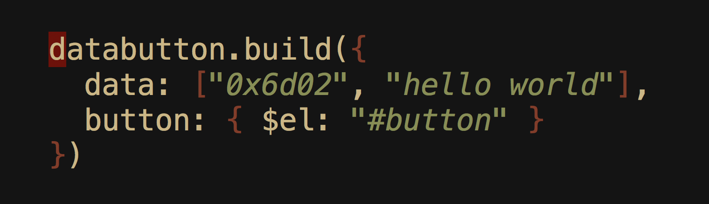

# Databutton

A [Datapay](https://github.com/unwriter/datapay) plugin to build Moneybutton



# Install

Include 3 scripts, in the following order:

```
<script src="https://www.moneybutton.com/moneybutton.js"></script>
<script src='https://unpkg.com/datapay'></script>
<script src='https://unpkg.com/databutton'></script>
```

# Usage

You can use Datapay to upload the following types to the blockchain:

1. ASCII String
2. Hex String
3. Binary

## 1. ASCII & Hex String

Similar to [datapay](https://github.com/unwriter/datapay) syntax, except that the `pay` part is replaced with `button`.

```
databutton.build({
  data: ["0x6d02", "hello world"],
  button: { $el: document.querySelector("#button") }
})
```

The `button.$el` can either be:

- an element
- selector

For example, you can use the selector notation instead of passing an element:

```
databutton.build({
  data: ["0x6d02", "hello world"],
  button: { $el: "#button" }
})
```

## 2. Binary & String

You can upload not just string but also files in raw binary format. For this, we introduce a new attribute called `file`. We use this instead of `data`.

The `file` attribute contains two child attributes:

- `$el`: the selector for the `input[type=file]` element. Databutton will listen to a file selection event, and will create a moneybutton.
- `data`: the same `data` attribute as ordinary datapay "data" payload, with a twist. You have access to 2 root level variables:
  - `databutton.file`: The ArrayBuffer formatted file which you can directly feed into the blockchain.
  - `databutton.type`: The file content type (`image/png`, `video/mp4`, etc.) as specified in https://www.iana.org/assignments/media-types/media-types.xhtml
  - `databutton.name`: The file name
  - `databutton.lastModified`: The lastModified attribute
  - `databutton.lastModifiedDate`: The lastModifiedDate attribute
  - `databutton.size`: The file size

Here's an example databutton code for building a `B://` protocol upload:

```
databutton.build({
  file: {
    $el: document.querySelector("#file"),
    data: [
      "19HxigV4QyBv3tHpQVcUEQyq1pzZVdoAut",
      databutton.file,
      databutton.type,
      "binary",
      databutton.name
    ]
  },
  button: {
    $el: document.querySelector("#button")
  }
})
```

Or, you can simply use the selectors

```
databutton.build({
  file: {
    $el: "#file",
    data: [
      "19HxigV4QyBv3tHpQVcUEQyq1pzZVdoAut",
      databutton.file,
      databutton.type,
      "binary",
      databutton.name
    ]
  },
  button: {
    $el: "#button"
  }
})
```


# Advanced

## 1. Send Moneybutton attributes

You can pass additional Moneybutton parameters to databutton's `button` object:

```
databutton.build({
  data: ["0x6d02", "hello world"],
  button: {
    $el: "#button",
    label: "swipe",
    to: [address],
    amount: "1",
    currency: "USD",
    onPayment: function(msg) {
      console.log(msg)
    }
  }
})
```

## 2. Add money transfer options

You can also specify additional `pay` attribute to send money. This is possible through the `$pay` attribute.


Currently `$pay` only has only one attribute: `to`, which is equivalent to datapay's ["pay.to" attribute usage](https://github.com/unwriter/datapay#4-to).

Here's an example:

```
databutton.build({
  data: ["0x6d0c", "topic", "hello world"],
  button: {
    $el: "#button",
    $pay: {
      to: [{
        address: "qq4kp3w3yhhvy4gm4jgeza4vus8vpxgrwc90n8rhxe",
        value: 100000
      }]
    }
  }
})
```
